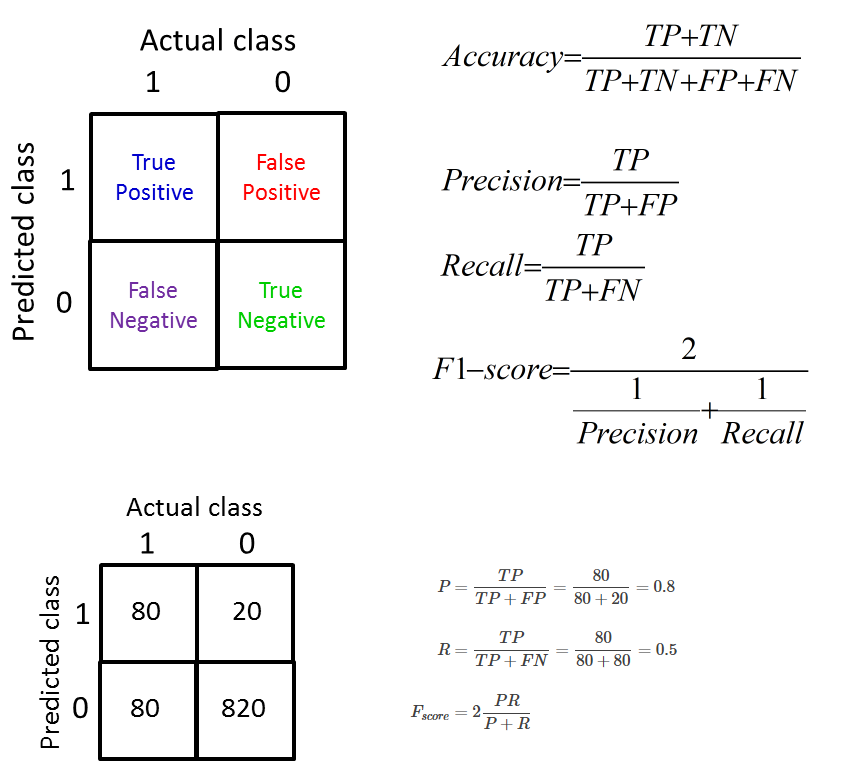

### 1. 本节视频10
本节视频中讲到的内容比较多也比较杂，但却**非常重要**。有一点不好的就是视频中的代码稍微有点乱，我会用一些其它方式来实现视频中代码（自己能看下去也行）。大家只要掌握好我列出的知识点即可。
### 2. 知识点
- 2.1 过拟合(over fitting)和欠拟合(under fitting)具体是指什么？常用的解决方法是什么？
    - [斯坦福机器学习-第三周（分类，逻辑回归，过度拟合及解决方法）](https://blog.csdn.net/The_lastest/article/details/73349592)
    - [机器学习中正则化项L1和L2的直观理解](https://blog.csdn.net/jinping_shi/article/details/52433975)
- 2.2 什么就超参数(hyper parameter)? 如何对模型进行评估？ 
    - 混淆矩阵(confusion matrix)
    
    - 准确性(accuracy)
    - 精确率(precision)
    - 召回率(recall)
    - F1-score(**精确率和召回率的调和平均**)
- 2.3 如何对模型进行筛选？
    - K折交叉验证(K-fold cross validation)
    - 并行参数搜索
- 2.2 如何解决样本分布不均？
    - 下采样(down sampling)示例1：以样本数少的类别为标准，去掉样本数多的类别中多余的样本；
    - 过采样(over sampling)示例2：以样本数多的类别为标准，对样本数少的类别再生成若干个样本，使两个类别中的样本一致；
 ### 3. 示例 
 - 3.1 示例1 [下采样](ex1.py)   
 - 3.2 示例2 [过采样](ex2.py)
  
 
 ### [<主页>](../README.md) [<下一讲>](../Lecture_04/README.md)   