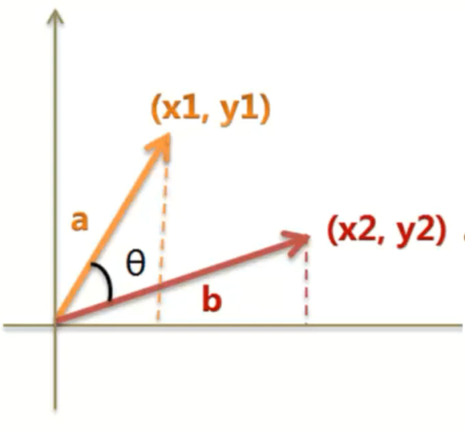

### 1. 本节视频
- 本节视频15,16
### 2. 知识点
- 2.1 贝叶斯算法和贝叶斯估计
    - [朴素贝叶斯算法与贝叶斯估计](https://blog.csdn.net/The_lastest/article/details/78807198)
    - 平滑处理（拉普拉斯平滑）
- 2.2 特征提取
    - 分词处理
        - [利用jieba进行中文分词并进行词频统计](https://blog.csdn.net/The_lastest/article/details/81027387)
    - 词集模型
    - 词袋模型
    - TF-IDF
        - [Scikit-learn CountVectorizer与TfidfVectorizer](https://blog.csdn.net/The_lastest/article/details/79093407)
- 2.3 相似度计算
    - 欧氏距离
    - cos距离
    
### 3. 示例
- [3.1 基于贝叶斯算法的中文垃圾邮件分类](ex1.py)
- [3.2 词云图](word_cloud.py)

### 4. 任务
- [4.1 在3.1的基础上，完成选取所有词中前5000个出现频率最高的词为字典构造TF-IDF特征矩阵，然后训练模型]()
- [4.2 基于贝叶斯算法和编辑距离的单词拼写纠正](ex2.py)
- [4.3 基于贝叶斯算法的中文新闻分类](ex3.py)
